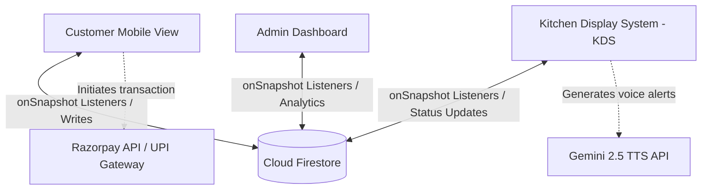

# Restro-Solve 🍽️

### *Serverless Digital Menu & Contactless QR Ordering System*

Restro-Solve is a state-of-the-art digital ordering platform designed to modernize restaurant operations. It eliminates paper menus, streamlines kitchen coordination, and provides real-time sales insights for administrators. Built with a **Direct-to-Cloud Serverless Architecture**, the platform connects customers, kitchen staff, and merchants instantly.

[](https://react.dev/)
[](https://www.typescriptlang.org/)
[](https://vitejs.dev/)
[](https://firebase.google.com/)
[](https://tailwindcss.com/)
[](https://deepmind.google/technologies/gemini/)
[](https://razorpay.com/)

---

## 🔗 Live Demo
Experience the live application hosted on Firebase CDN:
👉 **[https://restro-solve-c314f.web.app](https://restro-solve-c314f.web.app)** or **[https://restro-solve-c314f.firebaseapp.com](https://restro-solve-c314f.firebaseapp.com)**

---

## ⚡ Recruiter Highlights (Engineering Focus)

*   **Zero-Server Overhead (Direct-to-Cloud)**: Fully serverless. Eliminates standard middle-tier API servers (e.g. Express/Node.js) by communicating directly with Google Firebase Firestore, reducing operations cost and latency.
*   **Sub-100ms Real-Time Sync**: Utilizes Firestore real-time snapshots (`onSnapshot`) to push new orders from Customer devices to the Kitchen Display (KDS) and Admin dashboards instantly.
*   **Gemini AI TTS Kitchen Assistant**: Integrates the `GoogleGenAI` SDK to read incoming orders aloud in Hindi/English ("Table 5 has placed a new order of Butter Chicken...") using Gemini's native text-to-speech candidates.
*   **Secure Payment Intents**: Connects with Razorpay Checkout SDK and native UPI deep-linking for seamless mobile checkouts, handling asynchronous order confirmations.
*   **Mobile-First Glassmorphic UI**: Tailored specifically for smartphone browsers (which 99% of restaurant patrons use). Features high-performance touch feedback, slide animations, and printable thermal receipts.

---

## 🏗️ System Architecture

Restro-Solve is structured around a central serverless database. Client applications observe changes to collections in real time.



---

## 📊 Database Schema (Google Firestore)

The application operates using two primary collections:

### 1. `orders` Collection
Tracks order details, payments, and workflow progression.
```json
{
  "id": "ORD634891",                 // Human-readable Order ID
  "firebaseDocId": "uq56YcbaT9aX3",   // Firestore Document Auto-ID
  "tableNumber": "3",                 // Ordering Table
  "customerName": "Rahul Kumar",
  "customerPhone": "9876543210",
  "status": "PREPARING",              // PENDING, PREPARING, READY, SERVED, COMPLETED
  "paymentMethod": "UPI",             // Cash, UPI, PhonePe, GPay, Paytm
  "paymentStatus": "Paid",            // Paid, Unpaid
  "subtotal": 500,
  "tax": 25,
  "total": 525,
  "items": [
    {
      "id": "dish_102",
      "name": { "en": "Butter Chicken", "hi": "बटर चिकन" },
      "price": 250,
      "quantity": 2
    }
  ],
  "userId": "guest_1719283726_a9b8c", // Persistent device Guest ID
  "timestamp": "ServerTimestamp",      // Firestore Server Timestamp
  "completedAt": "ServerTimestamp"    // Added upon cash/online payment confirmation
}
```

### 2. `menu` Collection
Handles available food catalog items. Editable only by administrators.
```json
{
  "id": "dish_102",                   // Firestore Document ID
  "name": {
    "en": "Butter Chicken",
    "hi": "बटर चिकन"
  },
  "price": 250,
  "category": "Main Course",
  "isAvailable": true,                // Quick toggle for "Sold Out"
  "isVeg": false,                     // Diet indicator
  "imageUrl": "https://firebasestorage...", // Uploaded directly via Firebase Storage
  "createdAt": "ServerTimestamp"
}
```

---

## 🛠️ Local Setup & Installation

Follow these steps to configure and run the project locally on your machine:

### 1. Clone the Repository
```bash
git clone https://github.com/your-username/restro-solve.git
cd restro-solve
```

### 2. Install Dependencies
```bash
npm install
```

### 3. Setup Environment Variables
Create a `.env` file in the root directory by copying the `.env.example` template:
```bash
cp .env.example .env
```
Fill in your Razorpay, Google Gemini API, and Firebase configuration values.

### 4. Run the Dev Server
```bash
npm run dev
```
Open [http://localhost:5173](http://localhost:5173) in your browser.

---

## 🚀 Deployment

The project can be quickly deployed to Firebase Hosting:

### 1. Build the Production Bundle
```bash
npm run build
```

### 2. Deploy via Firebase CLI
Make sure you have `firebase-tools` installed globally:
```bash
npm install -g firebase-tools
firebase login
firebase init hosting
# Select "dist" as your public directory
# Configure as SPA: Yes
# Overwrite index.html: No

# Run Deploy
firebase deploy
```

---

*Developed with passion for modernizing hospitality services by the Restro-Solve Team.*
